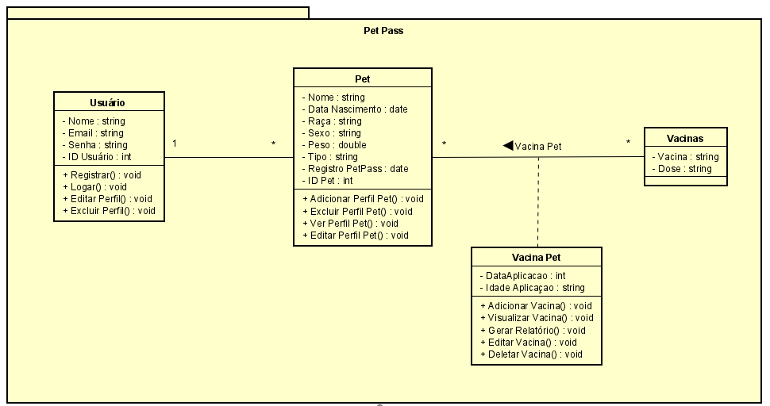

# Arquitetura da Solução

Pré-requisitos: <a href="3-Projeto de Interface.md"> Projeto de Interface</a>

Definição de como o software é estruturado em termos dos componentes que fazem parte da solução e do ambiente de hospedagem da aplicação.

## Diagrama de Classes

O diagrama de classes ilustra graficamente como será a estrutura do software, e como cada uma das classes da sua estrutura estarão interligadas. Essas classes servem de modelo para materializar os objetos que executarão na memória.

A seguir, é mostrado o Diagrama de Classes da aplicação Pet Pass:

## Modelo ER

O Modelo Entidade-Relacionamento (MER) representa, através de um diagrama, como as entidades (coisas/objetos) se relacionam entre si na aplicação interativa.

A seguir, é mostrado o MER da aplicação Pet Pass:

## Esquema Relacional

O Esquema Relacional corresponde à representação dos dados do Modelo ER em tabelas, juntamente com as restrições de integridade e chave primária (destacada em negrito) e chave estrangeira (apenas sublinhada).

A seguir, é mostrado o Esquema relacional da aplicação Pet Pass:

## Diagrama de componentes

Diagrama que permite a modelagem física de um sistema, através da visão de seus componentes e relacionamentos entre os mesmos.

A solução implementada conta com os seguintes módulos:

- **Navegador** - Interface básica do sistema  
- **Páginas Web** - Conjunto de arquivos JavaScript, TypeScript, React e imagens que implementam as funcionalidades do sistema.
- **Local Storage** - local onde serão implementados os bancos de dados em SQL server, utilizando as linguagens C# e Asp.NET.
- **API** - plataforma que permite a conexão e sincronização da aplicação com o g-mail do usuário.
- **Hospedagem** - local na Internet onde as páginas são mantidas e acessadas pelo navegador. 

## User Flow

Em complemento ao Diagrama de Fluxo, é destacado abaixo o *User Flow*, que apresenta a mesma ideia do diagrama anterior. Contudo, fornece uma visualização mais realista da interface pensada para a aplicação, utilizando para isso a concepção dos *Wireframes*.

O usuário acessa o endereço *web* onde a aplicação está hospedada e então tem acesso à homepage do sistema. Nesta etapa, ele poderá fazer login em sua conta, caso já esteja cadastrado, ou criar uma nova conta de usuário, login e senha. Após o login, ao entrar de fato no sistema, o usuário é direcionado para a homepage. Em seguida, ele poderá adicionar um perfil de Pet a sua conta, fornecendo todas as informações solicitadas acerca do Pet. Criado o perfil desse Pet, o usuário poderá associar a ele as vacinas que já foram aplicadas, escolhendo o tipo de vacina e informando a dose e a data de aplicação. Concluído o perfil do Pet, o usuário terá a opção, através da tela principal "Meus Pets", de visualizar o perfil do Pet criado (de forma detalhada), excluir o perfil desse Pet, ou de gerar um relatório das condições de vacinação do Pet selecionado.

## Tecnologias Utilizadas e Hospedagem da Aplicação

Para a elaboração da página web serão utilizadas as seguintes linguagens:
- Front-end: html, css, Bootstrap
- Back-end: C#, Asp.NET

Como ferramentas de diagramação serão utilizados:
- Figma (https://www.figma.com/)
- Lucidchart (https://www.lucidchart.com/pages/pt)
- Astah UML (https://astah.net/downloads/)

Como ferramentas de suporte ao design serão utilizados os seguintes sites:
- Coolors.co (https://coolors.co/palettes/trending)
- Flatcon (https://www.flaticon.com/br/)

Como ferramenta de registro dos testes de usabilidade será utilizado:
- Google Forms (plataforma de formulários do Google)

Para a elaboração do código será utilizado o Visual Studio 2019.

A hospedagem do site se dará na plataforma Microsoft Azure, que tem integração com o Visual Studio.
- Microsof Azure (https://azure.microsoft.com/pt-br/)
- O link do site hospedado na Microsoft Azure é: https://petpass20211214211928.azurewebsites.net/
