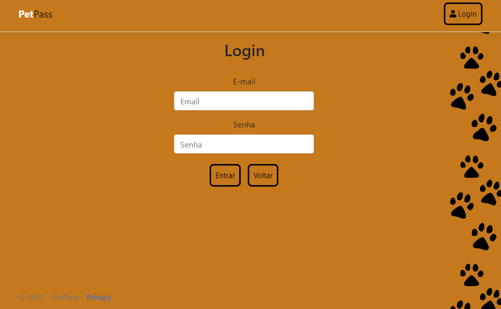
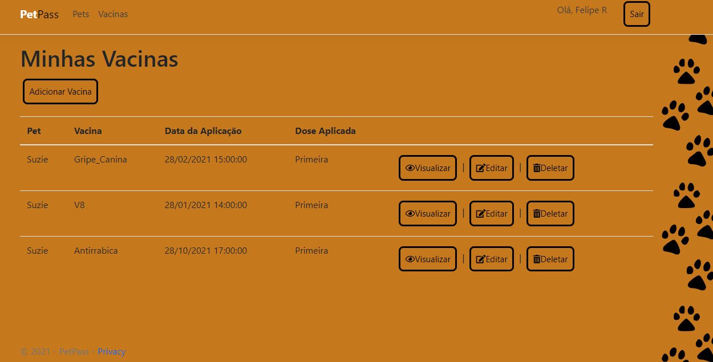

# Template padrão do site

Pré-requisitos: <a href="2-Especificação do Projeto.md"> Especificação do Projeto</a>, <a href="3-Projeto de Interface.md"> Projeto de Interface</a>, <a href="4-Metodologia.md"> Metodologia</a>

O site da _PetPass_ segue um padrão de _layout_ apenas nas telas de dentro do site. Ou seja, as telas referentes a cadastro de pets e vacinas, onde ficam expostos os pets cadastrados juntamente com suas respectivas vacinas. Esse padrão está de acordo com o layout do Bootsrap para _Websites_, que pode ser encontrado em: [boostrap Website](https://getbootstrap.com/).

Abaixo seguem três exemplos de templates distintos de telas que abrangem, de forma genérica, todo o rol de layout de telas montadas no sistema do PetPass.

Figura 1 - Homepage após autenticação

Figura 2 - Tela de Login

Figura 3 - Conteúdo da aplicação

Como é possível observar nas imagens acima, o template padrão da aplicação apresenta quatro regiões distintas:

- **Header:** É o cabeçalho da página. É fixo e idêntico em todas as telas. Nele constam o logo da empresa _Petpass_, um menu de navegação, no qual o usuário poderá acessar as telas com suas funcionalidades. A única excessão é a Homepage, que só mostra todos os botões do menu do Header após a autenticação do usuário no sistema.

- **Main Content:** É o conteúdo principal da tela. Tal conteúdo muda de acordo com a tela e suas respectivas funcionalidades.

- **Footer:** É o rodapé das telas que, no caso do sistema do PetPass, é fixo e invariável.
